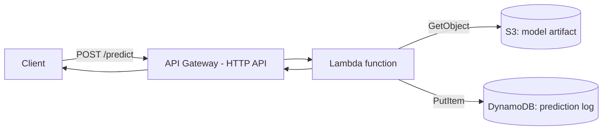

# Serverless AI/ML Inference API on AWS (Terraform)

A serverless machine learning inference API — API Gateway → Lambda → S3 +
DynamoDB — provisioned entirely with Terraform rather than clicked
together in the AWS Console. Built to demonstrate AWS Solutions Architect
skills (architecture design, Infrastructure as Code, least-privilege IAM,
documented trade-offs) alongside a real, working ML component.

The API takes a piece of text and classifies it as spam or ham
(not-spam) using a Naive Bayes model, logging every request/prediction
to DynamoDB.

## Architecture



All infrastructure is defined in Terraform (`.tf` files) and provisioned
via `terraform apply` — nothing was created by hand in the console.

## Why this architecture

**Serverless over containers/EC2:** traffic to a portfolio demo API is
sporadic and unpredictable — Lambda scales to zero when idle and you
pay per invocation, versus EC2 or a container service billing
continuously regardless of traffic. The trade-off is cold-start latency
(a small delay the first time a Lambda instance handles a request after
being idle) — acceptable here, but a real production system with
constant, high, latency-sensitive traffic would lean toward containers
or provisioned concurrency instead.

**HTTP API over REST API (API Gateway):** we only need to forward
requests straight to Lambda with no custom transformation — the
simpler, cheaper HTTP API type is the right tool; the older REST API
type's extra features (request/response mapping templates, usage
plans, etc.) would be unused complexity here.

**DynamoDB over a relational database:** the access pattern is simple
key-value writes/reads (one log entry per prediction, no joins needed).
DynamoDB is serverless-native — it scales with Lambda's concurrency
without connection-pool exhaustion issues traditional databases have
under Lambda's rapid scaling, and `PAY_PER_REQUEST` billing avoids
paying for reserved database capacity that would sit mostly idle.

**S3 for the model artifact:** decouples the trained model from the
Lambda deployment package — the model can be updated by re-uploading to
S3 without redeploying the Lambda function's code.

## IAM: least-privilege design

Two distinct identities exist in this project, deliberately scoped very
differently:

- **The human deployer** (an IAM user with `AdministratorAccess`) — used
  only to run Terraform and set up infrastructure. Broad access is
  acceptable here because it's a human making deliberate, reviewed
  changes.
- **The Lambda execution role** — scoped to exactly three permissions:
  `s3:GetObject` on the one specific model file (not the bucket, not any
  other bucket), `dynamodb:PutItem` on the one specific table, and
  CloudWatch Logs write access for its own execution logs. Nothing else.
  Even if this function's code were somehow compromised, it could not
  touch any other resource in the AWS account.

This mirrors a real production principle: the identity that *sets up*
infrastructure and the identity that *runs inside* it should almost
never have the same level of access.

## The ML deployment decision (and a real bug-hunt that validated it)

`scikit-learn` (and its dependencies `numpy`/`scipy`) contain OS-specific
compiled code. Packaging them for Lambda (which runs Amazon Linux) from
a Windows development machine reliably requires Docker or cross-platform
wheel building — real friction for a project whose focus is
infrastructure, not ML packaging.

Instead, the model is trained with scikit-learn locally, then only its
**learned parameters** (vocabulary and Naive Bayes log-probabilities)
are exported to a small JSON file. The Lambda function reimplements the
Naive Bayes prediction math in plain Python — no ML framework needed at
runtime at all, just `boto3` (pre-installed in every Lambda Python
runtime). This eliminates the dependency-packaging problem entirely,
keeps the deployment package tiny, and speeds up cold starts.

**Verified correct, not just assumed:** during testing, the sentence
"Are you free for a call tomorrow" was classified as spam by the live
API — surprising, since it's an ordinary message. Rather than assuming
a bug in the hand-written Lambda prediction logic, the real scikit-learn
model was checked directly against the same input, and it produced the
**identical** "spam" prediction. This confirmed the lightweight
reimplementation is mathematically correct — the real issue is a
dataset limitation: the training set has only 20 examples, and the word
"free" appears in 4 of 10 spam examples and zero ham examples, making it
a disproportionately strong signal that dominates short sentences
containing it. A production system would need a much larger, more
representative training set to avoid single-word bias like this.

## Repository structure

```
aws-ml-pipeline/
├── README.md
├── .gitignore
├── main.tf              provider configuration (aws, random, archive)
├── s3.tf                S3 bucket + model artifact upload
├── dynamodb.tf           DynamoDB table for prediction logging
├── iam.tf                Lambda execution role, least-privilege policy
├── lambda.tf             Lambda function resource
├── api_gateway.tf         HTTP API, route, integration, invoke permission
├── outputs.tf             prints the live API endpoint after deploy
├── lambda_function.py     Lambda handler (pure Python, no ML framework)
├── train_model.py         trains the model, exports lightweight JSON
└── spam_model.json        exported model parameters (uploaded to S3 by Terraform)
```

## How to deploy this yourself

Prerequisites: an AWS account, [Terraform](https://terraform.io) installed,
AWS CLI configured (`aws configure`) with credentials for an IAM user
(not root), and Python 3 with `scikit-learn` installed.

```bash
# 1. Train and export the model
python train_model.py

# 2. Provision everything
terraform init
terraform plan
terraform apply

# 3. Test it (PowerShell)
Invoke-RestMethod -Uri "<api_endpoint from terraform output>" `
  -Method POST -Body '{"text": "Win a free prize now"}' -ContentType "application/json"

# 4. Tear down when done (avoid ongoing charges)
terraform destroy
```

## Known limitations (documented, not hidden)

- The training set is small and synthetic (20 examples) — see the
  "free" bias finding above. A production classifier would need a much
  larger, more diverse, real-world-sourced dataset.
- The Terraform deployer IAM user uses `AdministratorAccess` for
  simplicity while learning — a real production setup would scope this
  down to exactly the permissions Terraform needs (S3, DynamoDB, Lambda,
  IAM, API Gateway management) rather than full admin access.
- Terraform state is stored locally (`terraform.tfstate`), not in a
  remote backend (like an S3 bucket with state locking via DynamoDB) —
  fine for a solo learning project, but a real team setup requires
  remote state so multiple people don't apply from conflicting local
  copies.
- No authentication on the API endpoint — anyone with the URL can call
  it. A production version would add an API key, IAM authorization, or
  a Cognito authorizer.

## License

MIT
